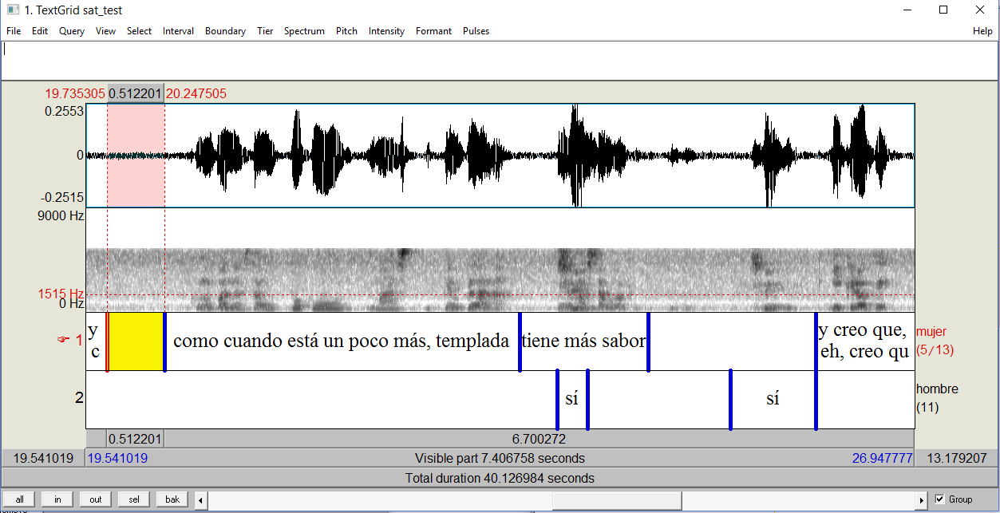

.. _preparation:

Preparing your Data
===================

Transcription Files
-------------------

The input to the force aligner is a wav file and the orthographic transcription associated with it. Transcriptions can be in either .TextGrid or .txt formats.

.TextGrid transcription
++++++++++++++++++++++

It is strongly suggested to use transcriptions in Praat TextGrid format. TextGrid transcripts are of the style of the example below:

This approach has many benefits over the .txt transcription approach:

#. *Each speaker on a separate tier*: more accurate alignments, especially in overlap or noisy conditions
#. *Exclusion of non-transcribed sections*: the aligner will only align where there is transcribed speech, this is helpful for ignoring speech not of interest to the analysis.
#. *Aligning in small intervals*: each interval is aligned separately, increasing accuracy. 

.txt transcriptions
+++++++++++++++++++

.. note:: Currently only speaker labels {S1}-{S99} are available for .txt transcriptions

Transcription Practices
-----------------------

Regardless of transcription method chosen, the process of transcribing is nearly identical.

- types of inputs allowed
- examples
- special symbols
- transcription best practices
- dictionary entries

.. _missing:

How to Add Missing Words
------------------------

How to add missing words